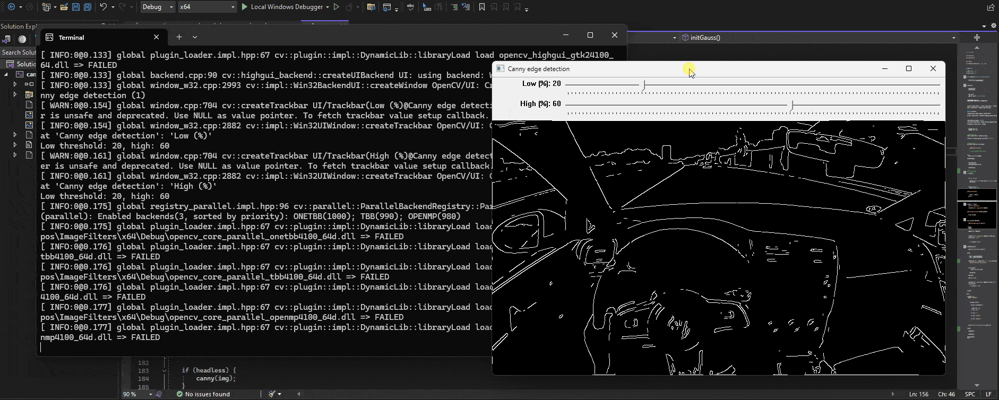
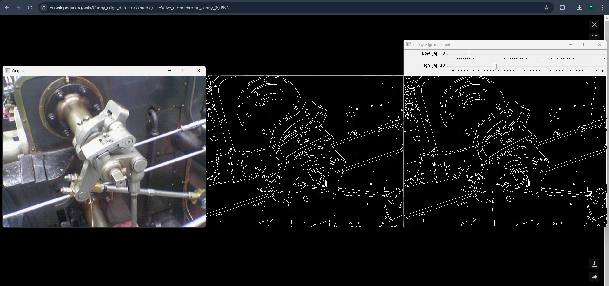

# What is this?
Canny edge detection implemented in CUDA C/C++. Supports images and video. OpenCV is used for loading and writing media. Compiled for CUDA compute capability 8.9 (compute_89, sm_89) and tested on RTX 4060.

Comparison with an example from the [article](https://en.wikipedia.org/wiki/Canny_edge_detector#):


# Configure
* headless - `true` for just writing output files, `false` for GUI
* media - `image` or `video`
* in - input path
* lowThreshold, highThreshold - percentages for retaining or discarding edges based on pixel values

# Compile
```sh
nvcc -arch=sm_89 -O3 -o canny main.cu kernels.cu `pkg-config --cflags --libs opencv4`
```

